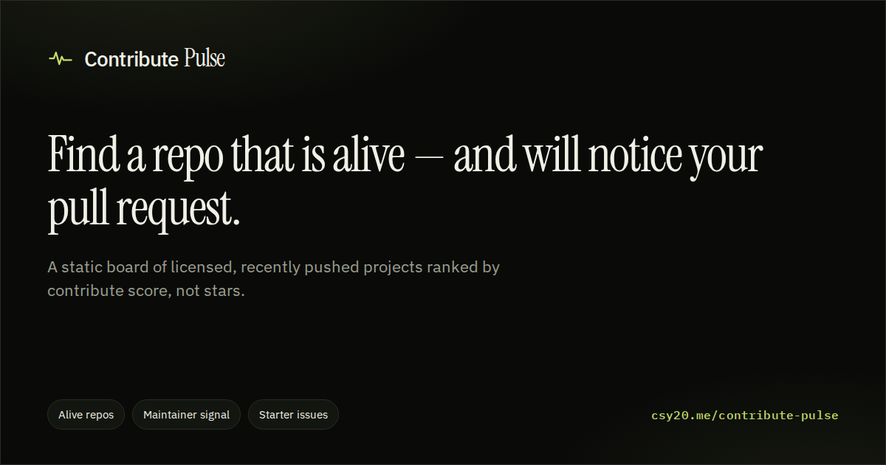

# Contribute Pulse

Find a repo that is alive — and will notice your pull request.

[](https://csy20.me/contribute-pulse/)

**Live:** [csy20.me/contribute-pulse](https://csy20.me/contribute-pulse/) · [Buy me a coffee](https://coff.ee/the__csy20)

Contribute Pulse is a public, static board of open-source GitHub repositories that are worth contributing to: licensed, recently pushed, mid-sized, and labeled so a new contributor has a place to start. Repos are grouped by human categories and ranked by a contribute score, not raw stars.

This is not a dump of every `good-first-issue`. It is a curated discovery board.

**Live data is precomputed.** GitHub Actions crawls GitHub twice a day and commits JSON, then deploys Pages from that same run. The website never calls the GitHub API from the browser.

## Local development

Requires Node 20+.

```bash
cp .env.example .env.local
# put a fine-grained GitHub PAT in GH_TOKEN
npm install
npm run dev
```

- `npm run dev` — Astro dev server
- `npm run build` — static build to `dist/`
- `npm run update-data` — crawl GitHub and write `data/latest.json`
- `npm test` — scoring and category-mapping checks

The first build works from the bundled sample JSON in `data/`. Run `npm run update-data` to replace it with a live crawl. Never commit `.env.local`.

## How GitHub Actions works

Two workflows:

1. **Update data** (`.github/workflows/update-data.yml`)
   - Cron: `0 2 * * *` and `0 14 * * *` (02:00 and 14:00 UTC) plus `workflow_dispatch`
   - Runs `npm run update-data` with `secrets.GH_TOKEN` if set, otherwise the built-in `GITHUB_TOKEN`
   - If `data/*.json` changed, commits as `github-actions[bot]` and pushes
   - Builds and deploys GitHub Pages in the **same run**, so a missing PAT still ships a fresh board
   - If the API errors or zero repos pass filters, the job fails and the previous JSON / Pages deploy stay

2. **Deploy** (`.github/workflows/deploy.yml`)
   - Builds the Astro site on code pushes to `main` / `master` (ignores data-only commits)
   - Publishes `dist/` to GitHub Pages
   - Sets `base` to `/<repo>/` automatically (or `/` for `username.github.io` repos)

`GITHUB_TOKEN` pushes do not start other workflows. That is why the crawler deploys Pages itself instead of relying on the Deploy workflow.

## Optional secret

The crawler runs without extra setup. For higher GitHub API rate limits (recommended once the board is busy), create a **fine-grained personal access token** and store it as the repository secret `GH_TOKEN`.

Suggested permissions:

- Repository access: public repositories (or this repo plus public metadata)
- **Contents:** Read and write (so the workflow can push JSON)
- **Issues:** Read
- **Pull requests:** Read
- **Metadata:** Read

Do not put `GH_TOKEN` in client code, Astro pages, or `public/`. The crawler is the only consumer.

Enable GitHub Pages: Settings → Pages → **GitHub Actions**.

## How to add a category mapping

Categories live in `scripts/category-map.ts`.

1. Add topic tokens to `TOPIC_CATEGORY_MAP` (lowercase, hyphenated).
2. Add description/name keywords to `DESCRIPTION_KEYWORDS` if needed.
3. Add search shards in `searchShardsForCategory()` so the crawler can find repos.
4. Display names and slugs are defined in `scripts/types.ts` (`CATEGORY_DEFS`).

A repo can belong to multiple categories. If the classifier is unsure, it stores `other` **and** the best guess.

## Scoring (short)

`contributeScore = 0.18·starBand + 0.28·freshness + 0.24·maintainerSignal + 0.20·issueQuality + 0.10·projectHealth`

Hard filters (all required): public, not archived, not a fork, has a license, description present, default branch, pushed in the last 45 days, 80–80,000 stars (mega-repos only via “Famous but hard”), and at least one open contributor-oriented issue.

The board is capped at 400 repos and 80 per category.

## Project layout

```
data/                  committed JSON board (sample, then live crawl)
scripts/update-data.ts crawler
scripts/category-map.ts
scripts/scoring.ts
src/pages/             Astro routes: /, /c/:category, /repo/:owner/:name, /about, 404
.github/workflows/
```

## License

MIT
